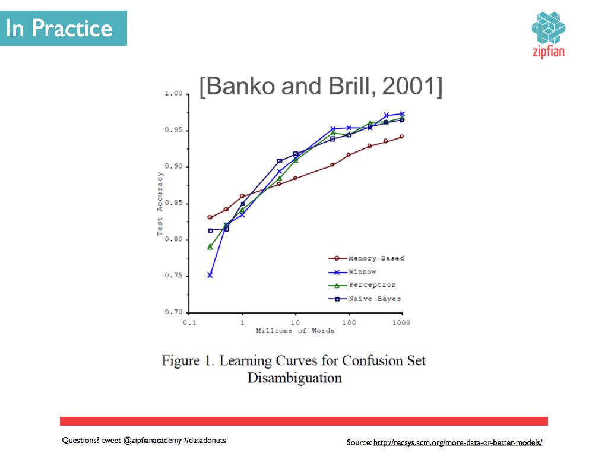
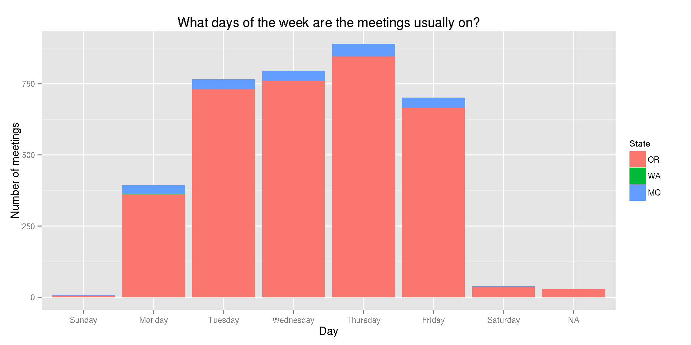
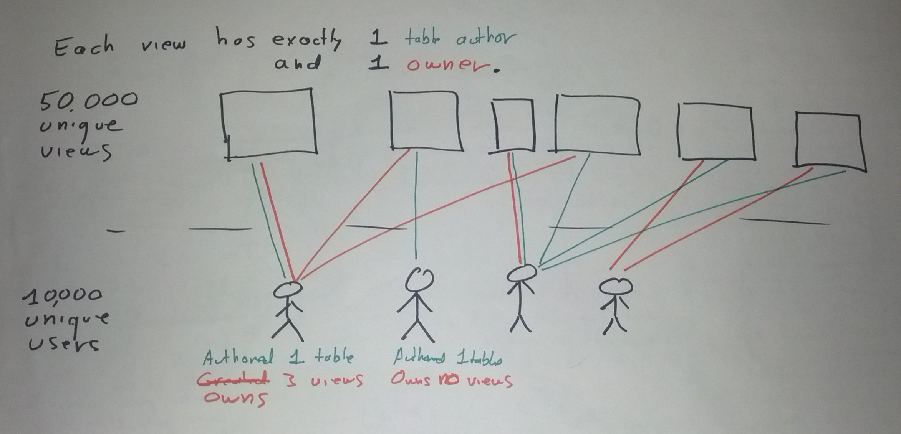
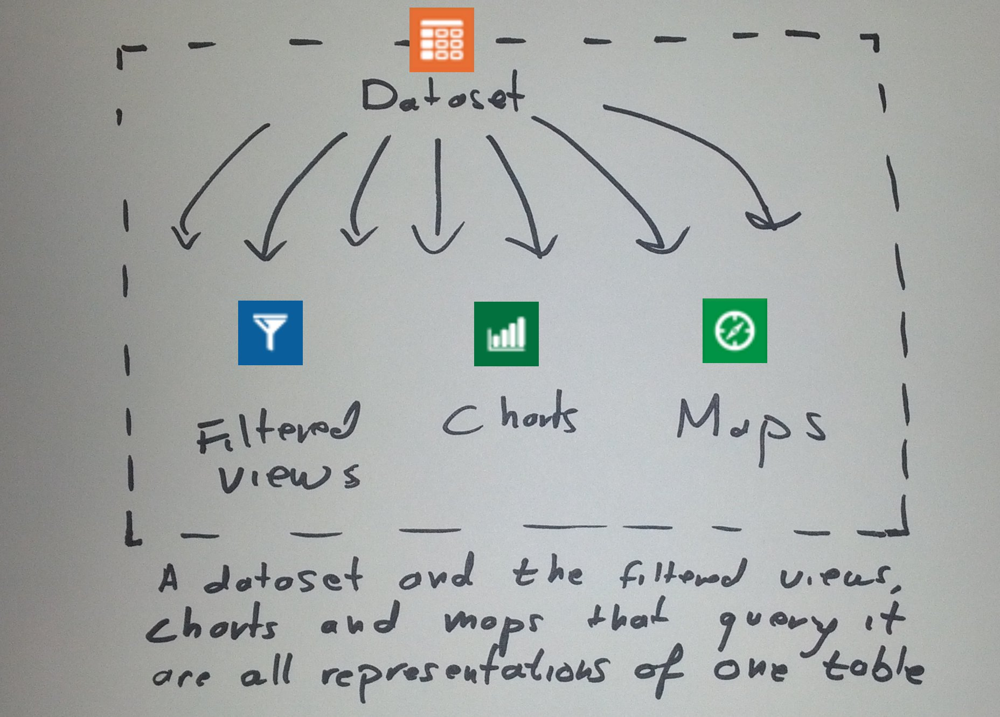
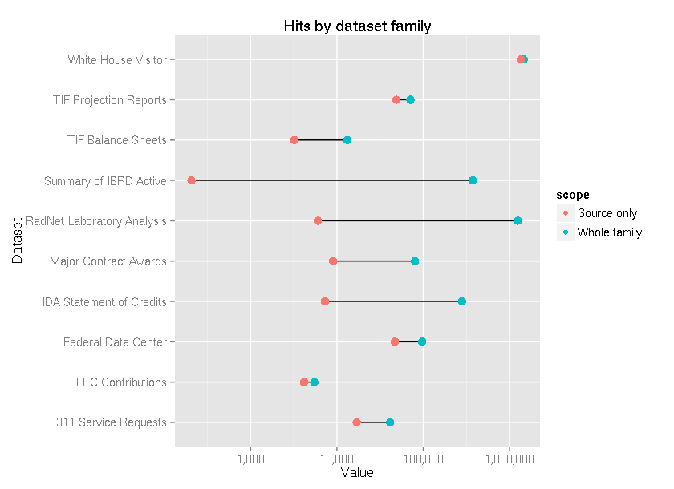
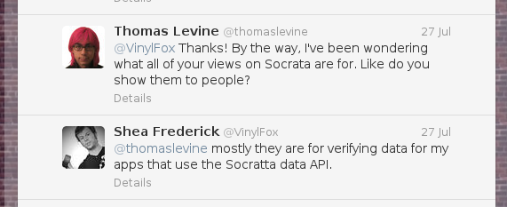

Meta Data Science
==================
Thomas Levine

# Meta data science

Datasets on [Socrata portals](https://data.seattle.gov) feel like files rather than data.

* Data science about data science
* Science about metadata

# Outline

1. Data science mindset <!-- or just my mindset -->
2. What I did
3. What I learned <!-- construction and usage -->
4. Things to consider

# Data science mindset

Exploit cheap computers to study how the world works.

1. Store everything.
2. Anything can be counted.
3. Numbers can be turned into anything.
4. Boring work should be sent to robots.
5. Get more data rather than tuning your model.

<!--
And this is what I was doing with the Socrata data
-->

## Store everything
<!--
Storage is cheap, so you should store everything that is easy to collect.
Store it in the most raw form that is convenient, and don't worry very
much about how or even whether you're going to analyze it.
-->

* Storage is cheap.
* You don't need a full research plan.

## Anything can be counted

* [Scans of letters](http://scott.thomaslevine.com)
* [Bikes](http://www.capitalbikeshare.com/system-data)
* [Turnstiles](http://www.theatlanticcities.com/commute/2013/05/visualizing-impact-mega-storms-transit/5660/)
* [Comments on rulemaking dockets](http://docketwrench.sunlightfoundation.com/)
  <!-- http://overview.ap.org/blog/2013/05/video-text-analysis-in-transparency/ -->

## Numbers can be turned into anything

* [FMS Symphony](http://fms.csvsoundsystem.com)
* [Ridership Rachenitsa](http://thomaslevine.com/!/ridership-rachenitsa)
* [gastronomify](http://github.com/csv/gastronomify)
* [Data](https://twitter.com/melsmo/status/352240097049071616) [cookies](https://twitter.com/internetrebecca/status/352955293291913217)

## Boring work should be sent to robots

* Computers can perform mindless tasks <!-- , just like people can. -->
* Computers can also make complex decisions <!--, just like people can. -->
* All analyses should be scripted.

## Get more data rather than tuning your model

<!--
* When I'm asked a question about the world, I adapt the question so that it can
    be approximately answered with an existing and convenient dataset.
* I look for opportunities to use existing stores of data in unintended ways.
-->

* Modeling problems versus computation/storage problems
* Confidence versus validity

* Don't collect new data to answer your new questions.
* Look for new ways of using existing data sources.
* Store raw data! Don't aggregate prematurely.

# What I did

Data science about open data

## Store everything
<!--
Most of the work was already done for me; people had connected
siloed government data into Socrata portals, and I just needed
to get it out. But I did get it out and store it on S3.
-->

## Anything can be counted

<!--
I think people thing of "metadata" as something you don't analyze quantitatively.

* Title
* Description
* Tags

But this is also metadata:

* Whether the title contains a particular word
* Number of rows, columns
* View counts
* Number of tags

-->

## Numbers can be turned into anything

[AppGen](http://www.appgen.me/browse)

## Boring work should be sent to robots
<!--
My colleague Jonathan played with the Site Analytics page
for the San Francisco portal and found something strange.
This diagram shows how we could detect something programmatically.
-->

[Site analytics](Datado.033.png)

[Scripted analyses](https://github.com/tlevine/socrata-analysis/tree/master/numbers)

## Get more data rather than tuning your model

* Metadata files (SODA 1 API)
* CSV datasets (only for New York)
* [Find users from datasets](http://thomaslevine.com/!/socrata-users)
* [Site metrics](http://thomaslevine.com/!/socrata-metrics-api/)
* [Other portal software](http://openprism.thomaslevine.com)

# What I learned

1. Nobody knows much
2. How Socrata Open Data portal is constructed
2. How people use Socrata Open Data portal

## What people know

* Portal administrators
* Portal developers
* Anecdotes

## Construction of Socrata Open Data Portal

### Data provenance

> Every view on Socrata has an "owner" and a "table author".
> What's an owner, and what's a table author?

<!--
Answer: XXX The view type diagram
Also note that this is not very strongly presented in the interface and that this makes it hard to tell which views are official
-->

### API limits

> What are Socrata's API limits?

I don't know, but they apply across all portals.

### Form validation

> What must be true about the form fields?

### One web application
With a some software, you have many different installations that might be able to communicate with each other.

* Wordpress
* CKAN

With other software, a single web application runs everything.

* Tumblr
* Socrata

<!--
Related:

* Geocoding
* They all go down at once.
-->

## How people use Socrata

### Analysis tools exist.

### People use them.

### But not really.

* http://thomaslevine.com/!/socrata-users#also-no-tables
* http://thomaslevine.com/!/socrata-users#with-a-profile-image

# Benefits of a data portal

(As I see it)

1. Import data from various formats.
2. Standard way of discovering datasets.
3. Convert data to standard formats.
4. Mark datasets as official in some sense.

# Things to consider

Data science

* Store/expose everything
* Datasets are data points, and metadata is data
* You can automate human work, even if it seems complicated.

Socrata

* What if the different portals were more connected?
    <!-- Currently, Socrata sort of fakes having separate applications. Having everything in the same application has different benefits from having separate applications, and maybe you can make use of them. -->
* Are the analysis tools important?

# References

* [My articles about open data](http://thomaslevine.com/socrata)
* [Most of the source code](https://github.com/tlevine/socrata-analysis/)
* [Data Donuts](http://zipfianacademy.com/presos/)
* [CSV Soundsystem](http://csvsoundsystem.com)

