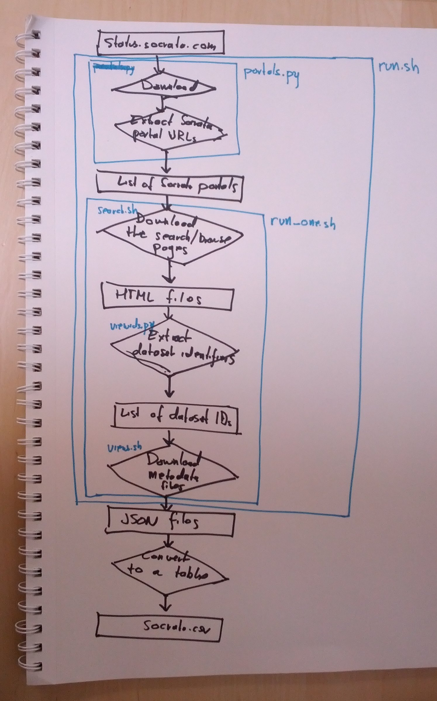
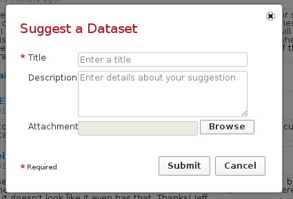
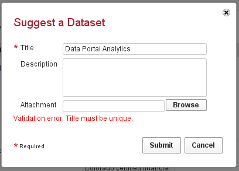

Meta Data Science
==================
Thomas Levine

## Meta data science

* Data science about data science?
* Science about metadata?

## Outline

1. Data science mindset
2. Data science about open data
3. Things I learned about Socrata
4. Things to consider

## Data science mindset
<!--
-->
> Exploit cheap computers to study how the world works.

1. Store everything.
2. Anything can be counted.
3. Numbers can be turned into anything.
4. Boring work should be sent to robots.
5. Get more data rather than tuning your model.

<!--
And this is what I was doing with the Socrata data
-->

### Store everything
<!--
Storage is cheap, so you should store everything that is easy to collect.
Store it in the most raw form that is convenient, and don't worry very
much about how or even whether you're going to analyze it.
-->

### Anything can be counted
<!--
-->
* http://scott.thomaslevine.com
* http://atlanticcities.com ...
* NLP

### Numbers can be turned into anything

* http://fms.csvsoundsystem.com
* http://thomaslevine.com/!/ridership-rachenitsa
* http://github.com/csv/gastronomify
* Data cookies

### Boring work should be sent to robots
<!--
-->

* Automatic and unobtrusive data collection---not questionnaires
* You don't need full-fleged research plan before you start collecting data.
* All analyses should be scripted.

### Get more data rather than tuning your model

* When I'm asked a question about the world, I adapt the question so that it can
    be approximately answered with an existing and convenient dataset.
* I look for opportunities to use existing stores of data in unintended ways.

## Data science about open data

### How I did it

#### Store everything
<!--
Most of the work was already done for me; people had connected
siloed government data into Socrata portals, and I just needed
to get it out. But I did get it out and store it on S3.
-->

#### Anything can be counted
<!--
I think people thing of "metadata" as something you don't analyze quantitatively.

* Title
* Description
* Tags

But this is also metadata:

* Whether the title contains a particular word
* Number of rows, columns
* View counts
* Number of tags

-->
I often run queries like this

    SELECT * FROM socrata WHERE ncol > 20 AND nrow > 10000 AND viewCount < 1000

#### Numbers can be turned into anything

* http://fms.csvsoundsystem.com
* http://thomaslevine.com/!/ridership-rachenitsa
* http://github.com/csv/gastronomify
* Data cookies

AppGen

#### Boring work should be sent to robots
<!--
-->

* Automatic and unobtrusive data collection---not questionnaires
* You don't need full-fleged research plan before you start collecting data.
* All analyses should be scripted.

#### Get more data rather than tuning your model

### What I learned

### Benefits of a data portal

1. Import data from various formats.
2. Standard way of discovering datasets.
3. Convert data to standard formats.
4. Mark datasets as official in some sense.

### Nobody knows what's on the portals
The only people who sort of know are people who help manage portals,
and they only know about the particular portals they help manage.

## Things I learned about Socrata Open Data Portal

<!--
1. Federation
2. Everything runs from the same application
3. It has analysis tools.
4. Nobody uses the analysis tools.
-->

#### Data provenance

> Every view on Socrata has an "owner" and a "table author".
> What's an owner, and what's a table author?

Answer: XXX The view type diagram
Also note that this is not very strongly presented in the interface and that this makes it hard to tell which views are official

#### API limits

> What are Socrata's API limits?

I don't know, but they apply across all portals.
It looks like everything is run through the same web application.
Related:

* Geocoding
* They all go down at once.

#### Form validation
What must be true about the form fields?

<!--
Has a title
Title is not unique
-->

#### One web application
With a some software, you have many different installations that might be able to communicate with each other.

* Wordpress
* CKAN

With other software, a single web application runs everything.

* Tumblr
* Socrata

## Things to consider

* What if the different portals were more connected?
    <!-- Currently, Socrata sort of fakes having separate applications. Having everything in the same application has different benefits from having separate applications, and maybe you can make use of them. -->
* Should Socrata Open Data Portal be faster?
    (Making it faster might qualitatively change how people use it.)
* Are the analysis tools important?
